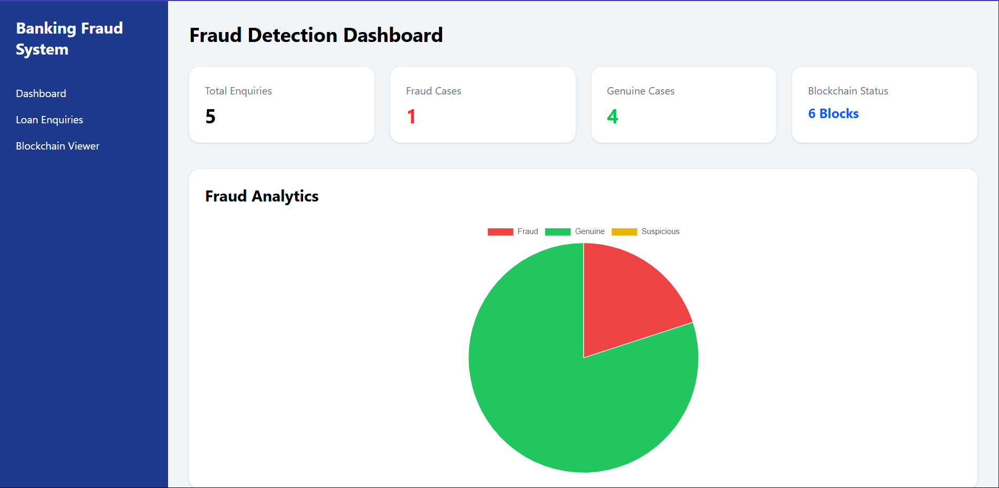

# Blockchain-Based AI Loan Fraud Detection System

## Overview

The Blockchain-Based AI Loan Fraud Detection System is a full-stack fintech application that helps banks identify suspicious and fraudulent loan enquiries before loan processing. The system uses AI-based risk analysis and blockchain technology to ensure secure, tamper-proof record management.

---

## Features

### Employee Authentication

* Employee Registration
* Secure Login
* Password Hashing

### Loan Enquiry Processing

* Customer Information Collection
* PAN Validation
* Risk Analysis
* Loan Classification

### Fraud Detection Engine

* Risk Score Calculation
* Genuine Detection
* Suspicious Detection
* Fraud Detection
* PAN-Phone Linkage Analysis

### Blockchain Security

* SHA-256 Hashing
* Blockchain Ledger
* Blockchain Validation
* Tamper Detection

### Dashboard Analytics

* Total Enquiries
* Fraud Cases
* Genuine Cases
* Blockchain Status
* Fraud Analytics Chart
* Recent Enquiries

---

## Technology Stack

### Frontend

* React.js
* Tailwind CSS
* Axios
* React Router
* Chart.js

### Backend

* FastAPI
* Python

### Database

* MongoDB

### Security

* SHA-256 Hashing
* Blockchain Validation

---

## System Architecture

```text
Bank Employee
      │
      ▼
React Frontend
      │
      ▼
FastAPI Backend
      │
 ┌────┴────┐
 ▼         ▼
Fraud      MongoDB
Engine     Database
 │
 ▼
Blockchain
Ledger
```

---

## Fraud Detection Logic

The system calculates a risk score using the following rules:

### Rule 1

Requested loan amount is significantly higher than annual income.

### Rule 2

Customer has too many existing loans.

### Rule 3

Customer already owns a car but requests a car loan.

### Rule 4

Multiple enquiries are found using the same PAN.

### Rule 5

The same phone number is linked to multiple PAN numbers.

---

## Risk Classification

| Risk Score | Status     |
| ---------- | ---------- |
| 0 - 29     | Genuine    |
| 30 - 59    | Suspicious |
| 60+        | Fraud      |

---

## Blockchain Implementation

Each loan enquiry is converted into a blockchain block.

Every block contains:

* Block Index
* Timestamp
* Enquiry Data
* Previous Hash
* Current Hash

Benefits:

* Tamper-Proof Records
* Immutable Audit Trail
* Blockchain Validation
* Secure Record Storage

---

## APIs

### Authentication

```http
POST /register
POST /login
```

### Loan Processing

```http
POST /loan-enquiry
```

### Dashboard

```http
GET /dashboard-stats
GET /recent-enquiries
```

### Blockchain

```http
GET /blockchain
GET /validate-blockchain
```

---

# Application Screenshots

## Login Page


## Dashboard



## Loan Enquiry Form


## Blockchain Viewer


---

## Future Enhancements

* Machine Learning Fraud Detection
* OCR PAN Verification
* Aadhaar Verification
* JWT Authentication
* Docker Deployment
* Cloud Deployment
* Role-Based Access Control

---

## Interview Highlights

This project demonstrates:

* Full Stack Development
* React Frontend Development
* FastAPI Backend Development
* MongoDB Integration
* Blockchain Implementation
* Fraud Detection Systems
* Secure Application Design
* Dashboard Analytics

---

## Author

**Shubhojeet Ghosh**
**Shreyasi Mitra**

Blockchain-Based AI Loan Fraud Detection System

Built using React, FastAPI, MongoDB, Blockchain Technology, and Fraud Analytics.
